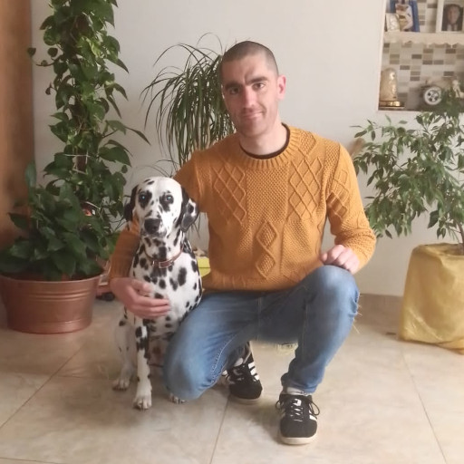

# Tony's Website :)

I am A.G. Tony Barletta, an italian developer who likes to learn and build new things.
I currently working in the banking sector as Full stack Java web developer.
I build this website to have a place to collect all the links to my accounts and projects.

## My dotted dog



## My skills

I have programmed in programming languages during my university experience.
I feel confident programming in C, Java and Javascript/Typescript, SQL, bash/unix shell script, html, css.
I can get along with Python, C++, x86 assembly, php.

The libraries and frameworks I used the most are: Java EE, Node.js (Express.js), Angular2+, bootstrap.
I also used in the past OpenCv with c++, Tensorflow, Keras and numpy with Python, Apache adoop, apache sparks with Java.

In recent year I have being playing with linux desktop envirnoments and dynamic windows managers (dwm).

## My tech

```plaintext
       _,met$$$$$gg.          tony@tony-debian
    ,g$$$$$$$$$$$$$$$P.       ----------------
  ,g$$P"     """Y$$.".        OS: Debian GNU/Linux 11 (bullseye) x86_64
 ,$$P'              `$$$.     Host: K56CB 1.0
',$$P       ,ggs.     `$$b:   Kernel: 5.10.0-6-amd64
`d$$'     ,$P"'   .    $$$    Uptime: 1 hour, 33 mins
 $$P      d$'     ,    $$P    Packages: 4399 (dpkg), 7 (snap)
 $$:      $$.   -    ,d$$'    Shell: bash 5.1.4
 $$;      Y$b._   _,d$P'      Resolution: 1366x768, 1920x1080
 Y$$.    `.`"Y$$$$P"'         WM: dwm
 `$$b      "-.__              Theme: Breeze [GTK3]
  `Y$$                        Icons: breeze [GTK3]
   `Y$$.                      Terminal: konsole 
     `$$b.                    Terminal Font: SauceCodePro Nerd Font Mono 10
       `Y$$b.                 CPU: Intel i7-3537U (4) @ 3.100GHz
          `"Y$b._             GPU: Intel 3rd Gen Core processor Graphics Controller
              `"""            GPU: NVIDIA GeForce GT 740M
                              Memory: 2274MiB / 7842MiB
```

## Contact page

Use my email or my Linkedin. Alternatively fill the [contact page form](contacts.html)

## Accounts and links

- email: agtonybarletta[at]gmail.com
- [Linkedin](https://www.linkedin.com/in/antonio-gaetano-barletta/)
- [self hosted webgit](http://agtonybarletta.it/gitweb/)
- [github](https://github.com/agtonybarletta)
- [stack overflow](https://stackoverflow.com/users/9652435/tony-barletta)

